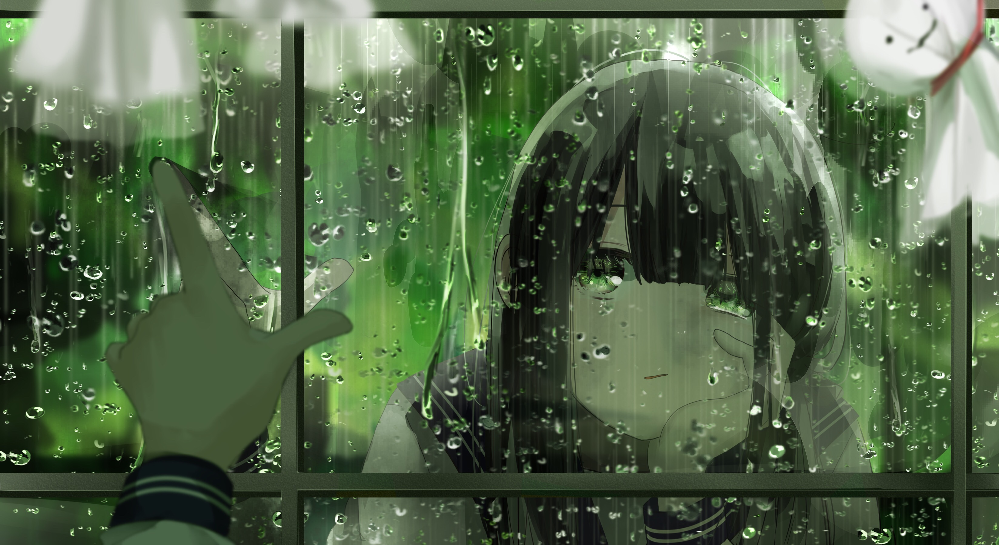

# & #12300 ;mirror mirror tell you what& #12301 ; `EN#279`

---

> 06/11/24
> #poetry 
> #language/english 
> #poetry/type/free-verse 
> #poetry/rhymed/🟡 
> #poetry/rating/⭐⭐⭐⭐ 
> #introspection #existential #despair #loss #isolation #duality #chaos #trapped #cathartic  #desire #frustration #hopeful #determination #wrath #change #mystery #dark #courage #freedom #lost #motivating #trapped 

---

mirror mirror on the wall, who is this person i have become.
mirror mirror on the wall, why does this face hide my soul.
mirror mirror on the wall, where did this chasm come from.
mirror mirror on the wall, who wrote a bass so apropos.

mirror mirror i ask thee so, why does loss sprawl through all.
mirror mirror i ask thee so, why is everyone around a thrall.
mirror mirror tell me so, can i please go totes awol.
mirror mirror tell me so, what's the meaning, what's the point,

art, existence, purpose, love, family, friends, healing, growth,
who, where, why and what, words, pointing, at the, wall.
leave. me. all. alone. 
let me. make. myself. a clone.
i will. do. what the hell. i want.
i want. to write. the end. i want.