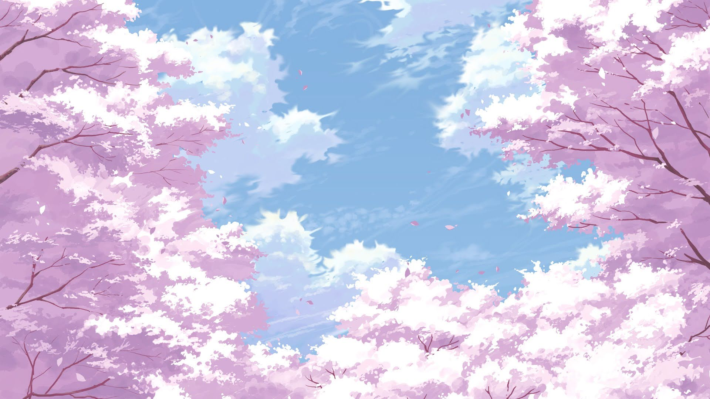

# 「ピンク / pink / róż」 `JP#005 / EN#249 / PL#1161*

---

> 22/08/24
> #poetry 
> #language/japanese #language/english #language/polish #language/multilingual
> #poetry/type/haiku 
> #poetry/rhymed/🔴 
> #poetry/rating/✨✨✨✨✨ 
> #whimsical #nature #tranquility #ephemerality #awe #cathartic #humour #uplifting 

---

桜咲く (sakura saku)  
ピンクの渦や (pinku no uzu-ya)  
鼻の上 (hana no ue)  
  
as sakura blooms  
pink swirls flying everywhere  
one falls on my nose  
  
wiśnia rozkwita  
wiry różu spadają  
jeden na mój nos